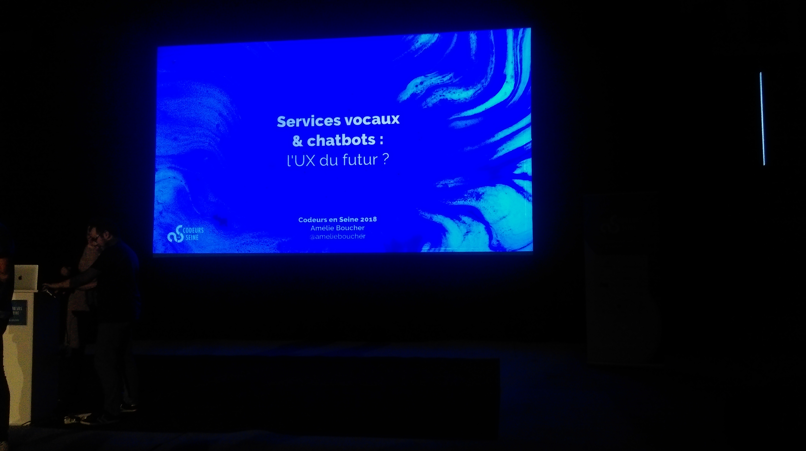

# Résumé conférence Codeur en Seine 2018 Thomas Tiphagne

## Cartouche d'identification

 - Manifestation : CodeursEnSeine 2018
 - Lieu : Kindarena
 - Conférence : Service vocaux & chatbots : l'UX du futurs?
 - Horaire de la conférence : 14h30
 - Durée de la conférence : 50 minutes
 - Conférencier(s) :
   - [Amélie Boucher](https://twitter.com/amelieboucher)
 - Audience : Environ 250 personnes
 - Auteur du billet : Thomas Tiphagne
 - Mots-clés : Chatbots, service vocaux, enceintes connectées, UX
 - URL de l'illustration : 
   - quelques sources : https://ux-surlegateau.com

## Support
 - Lien vers le support (diapos) présenté en conférence
 - Nombre de diapos du support : 32
 - Plan du support :
    - Enceintes connectée
      - Oportunitées
      - Contraintes
    - Chatbots
      - Opportinutées
      - Contraintes

## Résumé
Dans cette conférence Amélie Boucher, ergonome & UX Designer, nous présente les buzzwords du moments, c'est-à-dire les chatbots et services vocaux. Et nous présente les différentes opportunitées que l'on peut y voir, les craintes que l'on peut formulées et enfin les impacts à l'heure actuelle pour les usagers. Tout d'abord cela commence par les services vocaux et les enceintes connectées. Pourquoi c'est génial. Ces services sont très bien percue par les usagers car elles sont présentes dans l'espaces physique et de plus ces enceintes ont des intéractions avec les usagers. De plus ce n'est que de l'audio et donc pas d'effort physique et donc il y a un bon rapport entre efficacité et cout humain. Malheureursement il y a de nombreuses contraintes à l'utilisation de ces services vocaux. Notamment le fait qu'il faille faire du bruit pour les utiliser ce qui peut etre inadapté à l'enviroment. Il y a aussi un problème d'efficience, en effet ces services sont inadaptés pour des réponses fournies avec des comparaisons. Il y a aussi de la limitation dans les possibilitées, principalement pour l'achat de produit, en effet l'enceinte propose des produits, mais on a pas de liberté de choix, problème d'efficience plus paradoxe du choix. Pour des questions de vie, on a tendance à croire ce que l'enceinte dit, 1 réponse = LA réponse.  Pour ce qui est des chatbots, les utilisateurs les aiment car c'est naturel à l'utilisation (à cause des systèmes de messagerie), c'est malheureusement beaucoup de promesses pour peu de resultats. Ils sont surtout fait pour s'amuser. Pour les chatbots il faut faire attention à l'ambiguïté humain/robot. Attention aux fausses publicités, la plupart des chatbots ne sont pas des IAs. En conclusion il est ressortie qu'il vaut mieux ne pas avoir de chatbots que d'avoir un mauvais.

## Architecture et facteur qualité
  - 01 : Conformité : contenir un minimum d'erreurs, 
à satisfaire aux spécifications et à remplir ses 
missions dans les situations opérationnelles 
définies. En effet que ce soit pour service vocaux ou chatbots, les deux sont destinés a des millions d'utilisateurs comme des services et donc doivent comporté un minimums de bugs ou d'erreurs.
  - 05 : Utilisabilité : minimiser l'effort nécessaire pour 
l'apprentissage, la mise en oeuvre des entrées et 
l'exploitation des sorties. Comme pour le facteur de conformité ces deux services sont destiné à tout public et donc ne doivent pas être trop compliqué a prendre en main.
